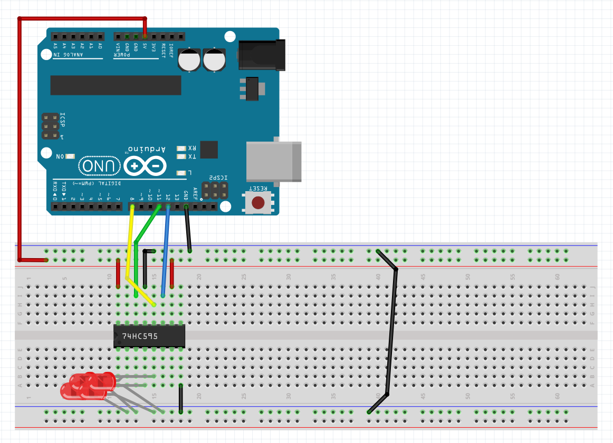

# ShiftRegister

### Arduino library to interact with shift registers such as 74HC595

## ⏬ Installation

[Download the library](https://github.com/exybore/arduino-shift-register/archive/master.zip) as a .zip, and extract its content in the `libraries` folder of your Arduino IDE installation. Be careful to rename the folder into `ShiftRegister`.

## 🔌 Hardware setup

For this guide, we're going to use a 74HC595 with this cabling :



We connected four LEDs to the 2nd, 3rd, 4th and 5th pins. You can change where the blue, green and yellow wires are located, but the red and black ones must stay here : they're power inputs and outputs.

For this register,

- the yellow wire is the latch pin, named RCLK
- the green one is the data pin, named SER
- the blue wire is the clock pin, named SRCLK

You can find further informations on the [manual](http://www.ti.com/lit/ds/symlink/sn74hc595.pdf).

## ⌨ Code setup

First of all, include the library at the top of your code :

```cpp
#include "ShiftRegister.h"
```

Then, we're going to declare our register using the `ShiftRegister` class :

```cpp
ShiftRegister shiftRegister(12, 8, 11, 8);
```

The constructor takes four parameters :

- The clock pin (here : 12, the blue wire)
- The latch pin (here : 8, the yellow wire)
- The data pin (here : 11, the green wire)
- The number of pins available on the register (here : 8 total pins)

Finally, we're going to install our register in the `setup` part of our code :

```cpp
void setup() {
  shiftRegister.setup();
}
```

That's as simple !

## 💡 Outputing power to pins

To set a pin in high or low, we're going to use the `setPin` function of our class. Pass the pin number and its state as parameters :

```cpp
void loop() {
  shiftRegister.setPin(2, HIGH);
}
```

Here, the 2nd pin will be on. We can repeat with all the pins we want :

```cpp
void loop() {
  shiftRegister.setPin(2, HIGH);
  shiftRegister.setPin(3, HIGH);
  shiftRegister.setPin(5, HIGH);
}
```

In order to tell the register each pin's state, we simply use the `save` function that, like it's said, will save our changes to the register :

```cpp
void loop() {
  shiftRegister.setPin(2, HIGH);
  shiftRegister.setPin(3, HIGH);
  shiftRegister.setPin(5, HIGH);

  shiftRegister.save();
}
```

If you apply modifications after saving, the old ones that you didn't touch will be kept :

```cpp
void loop() {
  shiftRegister.setPin(2, HIGH);
  shiftRegister.setPin(3, HIGH);
  shiftRegister.setPin(5, HIGH);

  shiftRegister.save(); // pins 2, 3 and 5 are on

  shiftRegister.setPin(3, LOW);
  shiftRegister.save(); // pins 2 and 5 are on
}
```

Check out this [basic usage example](examples/BasicUsage/BasicUsage.ino), in which we create a nice loop !

## 📃 License

MIT License

Copyright (c) 2019 Exybore

Permission is hereby granted, free of charge, to any person obtaining a copy
of this software and associated documentation files (the "Software"), to deal
in the Software without restriction, including without limitation the rights
to use, copy, modify, merge, publish, distribute, sublicense, and/or sell
copies of the Software, and to permit persons to whom the Software is
furnished to do so, subject to the following conditions:

The above copyright notice and this permission notice shall be included in all
copies or substantial portions of the Software.

THE SOFTWARE IS PROVIDED "AS IS", WITHOUT WARRANTY OF ANY KIND, EXPRESS OR
IMPLIED, INCLUDING BUT NOT LIMITED TO THE WARRANTIES OF MERCHANTABILITY,
FITNESS FOR A PARTICULAR PURPOSE AND NONINFRINGEMENT. IN NO EVENT SHALL THE
AUTHORS OR COPYRIGHT HOLDERS BE LIABLE FOR ANY CLAIM, DAMAGES OR OTHER
LIABILITY, WHETHER IN AN ACTION OF CONTRACT, TORT OR OTHERWISE, ARISING FROM,
OUT OF OR IN CONNECTION WITH THE SOFTWARE OR THE USE OR OTHER DEALINGS IN THE
SOFTWARE.
